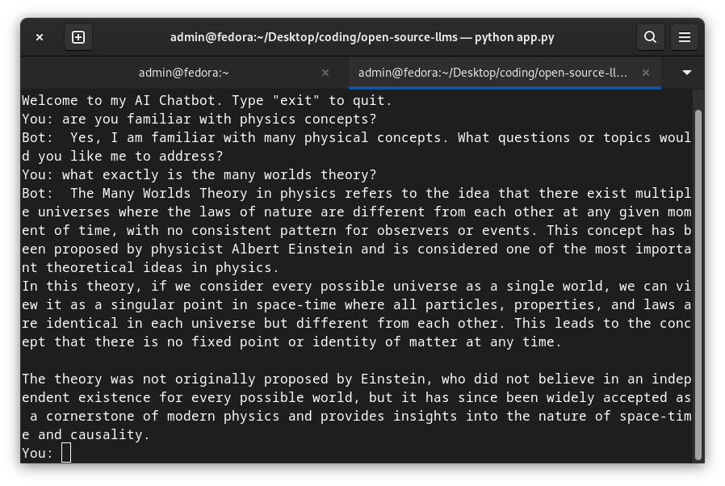

# open-source-llms
 In this repository, I try to utilize and compare open source LLMs from Ollama. Open source LLMs are similar to ChatGPT, but a better definition would be:

 > Open-source large language models (LLMs) are sophisticated neural network-based models designed to understand and generate human language. These models are trained on vast amounts of text data and are capable of performing a wide range of natural language processing tasks such as text generation, translation, summarization, question-answering, and more. The "open-source" aspect means that the model's code and, in some cases, its trained weights are made publicly available for anyone to use, modify, and distribute.

I utilized Ollama, a platform that provides  accessible and efficient tools for working with advanced LLMs. You can find more information ate their site here [Ollama] (https://ollama.com/). You should install its CLI helper based on your OS.

For linux based distros, open the terminal and run:
```bash
    curl -fsSL https://ollama.com/install.sh | sh
```
Once install, command finishes executing confirm if it really does exit on your system:
```bash
    ollama
```

Next you download an LLM of your choosing. There is a list of multiple LLMs on Ollama's [library] (https://ollama.com/library), and you can choose which one best suites your needs. I downloaded 2 popular LLMs, :
- qwen2:0.5b by Alibaba.
```bash
    ollama pull qwen2:0.5b
```
- gemma:2b by Google Gemini project
```bash
    ollama pull gemma:2b
```

They were chose in respect to their resource intensiveness. qwen2:0.5b has around 0.5 billion parameters and only takes up about 352b at the time of documenting this. gemma:2b only has 2 billion parameters and takes up a whooping 1.7GB of space at the time of documenting this.
> Parameters are the weights and biases of the neural network, and they determine how the model processes and generates text

### Running simple prompts in the terminal

To generate simple prompt within the terminal, one uses ollama's run command followed by the model you would like to use to shift into an interactive terminal. 

```bash
    ollama run qwen2:0.5b
```
once in the interactive terminal, you simple input your query and wait fro a response. 

```bash
    >>> what is the general plot of Rick and Morty?
```
attached below are pictures of various reponse from both qwen2:0.5b and gemma:2b, showing a clear contrast of their fine-tuning.


If you are a Rick and Morty fan, then you know that both of these answers are totally wrong, but taking a closer look, we can all agree that the gemma:2b LLM was closer to getting it right. It is however important to note that gemma used up alot more processing power to generate the response as compared to qwen2:0.5b that returned the results almost instantly.

### Running code prompts

To see their effectiveness when operated on programatically, i used a simple python script to compare the results generated:
```bash
    from langchain_ollama import OllamaLLM


    model = OllamaLLM(model='qwen2:0.5b')
    # model = OllamaLLM(model='gemma:2b')

    result = model.invoke(input='Why is the sky blue?')

    print(result)
```

depending on the LLM to used, you can comment and where necessary. The results were quite similar this time though the time taken to generate a reponse by gemma:2b seemed to be thrice as long as that taken by qwen2:0.5b


The top response is by qwen2:0.5b and the bottom one is by gemma:2b. Due to resource intensiveness, I opted to proceed with the lightweight open source llm(qwen2:0.5b) though if you are not restrained in terms of resources, it would be advisavle to go for even bigger llms with more parameters as they seem to be more accurate.

### Running a chatbot on the terminal

```python
    # import the necessary libraries
    from langchain_ollama import OllamaLLM
    from langchain_core.prompts import ChatPromptTemplate


    template = """
    Answer the below question.

    Here is the conversation history: {context}

    Question: {question}

    Answer:
    """

    prompt = ChatPromptTemplate.from_template(template)

    model = OllamaLLM(model="qwen2:0.5b")

    # chain the prompt to the model
    chain = prompt | model

    # create function to allow for a history in chats
    def local_chatbot():
        context = ''
        print('Welcome to my AI Chatbot. Type "exit" to quit.')
        while True:
            user_input = input('You: ')
            if user_input.lower() == 'exit':
                break

            # generate a response
            result= chain.invoke({"context":context,"question":user_input})
            print('Bot: ', result)
            # storing the conversation history
            context += f"\nUser: {user_input} \nAI:{result}"

    # call the function and execute it, until user exits
    if __name__ == "__main__":
        local_chatbot()
```

this works well allowing you to mimic an actual chatbot on the terminal as seem 

### Connecting to a local database


```python

    from langchain_community.utilities import SQLDatabase
    from langchain_core.prompts import ChatPromptTemplate
    from langchain.memory import ConversationBufferMemory
    from langchain_core.prompts import ChatPromptTemplate, MessagesPlaceholder
    from langchain_core.output_parsers import StrOutputParser
    from langchain_core.runnables import RunnablePassthrough
    from langchain_core.runnables import RunnableLambda
    from langchain_community.chat_models import ChatOllama
    from dotenv import load_dotenv
    import os

    load_dotenv('.env')

    # set the llm we want to use
    # llm = ChatOllama(model="gemma:2b")
    llm = ChatOllama(model="qwen2:0.5b")
    USERNAME = 'sa'

    # use string interpolation to create a connection string variable
    connectionString = f"""
        DRIVER={{ODBC Driver 17 for SQL Server}};
        SERVER={os.getenv('SERVER')};
        DATABASE={os.getenv('DATABASE')};
        UID={USERNAME};
        PWD={os.getenv('PASSWORD')};
        """

    uri=os.getenv('uri')

    db = SQLDatabase.from_uri(uri, sample_rows_in_table_info=0)


    def get_schema(_):
    return db.get_table_info()


    def run_query(query):
    return db.run(query)

    template = """Given an input question, convert it to a SQL query. No pre-amble. Based on the table schema below, write a SQL query that would answer the user's question:
    {schema}
    """
    prompt = ChatPromptTemplate.from_messages(
        [
            ("system", template),
            MessagesPlaceholder(variable_name="history"),
            ("human", "{question}"),
        ]
    )

    memory = ConversationBufferMemory(return_messages=True)

    # Chain to query with memory

    sql_chain = (
        RunnablePassthrough.assign(
            schema=get_schema,
            history=RunnableLambda(lambda x: memory.load_memory_variables(x)["history"]),
        )
        | prompt
        | llm.bind(stop=["\nSQLResult:"])
        | StrOutputParser()
    )


    def save(input_output):
        output = {"output": input_output.pop("output")}
        memory.save_context(input_output, output)
        return output["output"]


    sql_response_memory = RunnablePassthrough.assign(output=sql_chain) | save
    memory_response = sql_response_memory.invoke({"question": "how many users do i have in my database?"})
    print(memory_response)


    # Chain to answer
    template = """Based on the table schema below, question, sql query, and sql response, write a natural language response:
    {schema}

    Question: {question}
    SQL Query: {query}
    SQL Response: {response}"""
    prompt_response = ChatPromptTemplate.from_messages(
        [
            (
                "system",
                "Given an input question and SQL response, convert it to a natural language answer. No pre-amble.",
            ),
            ("human", template),
        ]
    )

    full_chain = (
        RunnablePassthrough.assign(query=sql_response_memory)
        | RunnablePassthrough.assign(
            schema=get_schema,
            response=lambda x: db.run(x["query"]),
        )
        | prompt_response
        | llm
    )

    memory_chain = full_chain.invoke({"question": "List me all the users from my users table who are admins"})
    print(memory_chain)
```

further documentation on this can be found [here](https://github.com/langchain-ai/langchain/blob/master/cookbook/LLaMA2_sql_chat.ipynb) 
