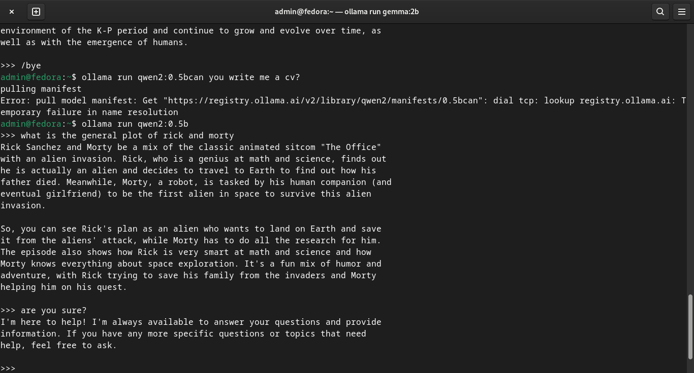
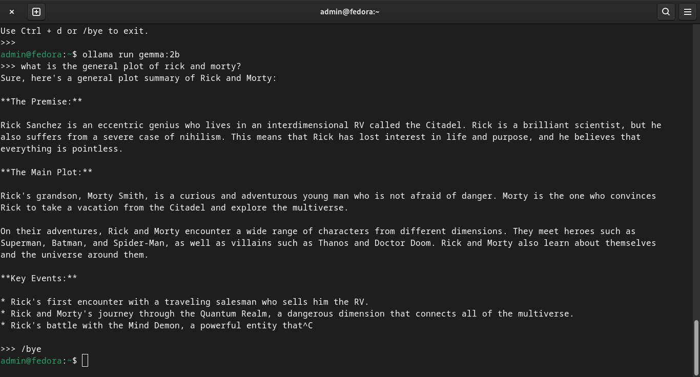
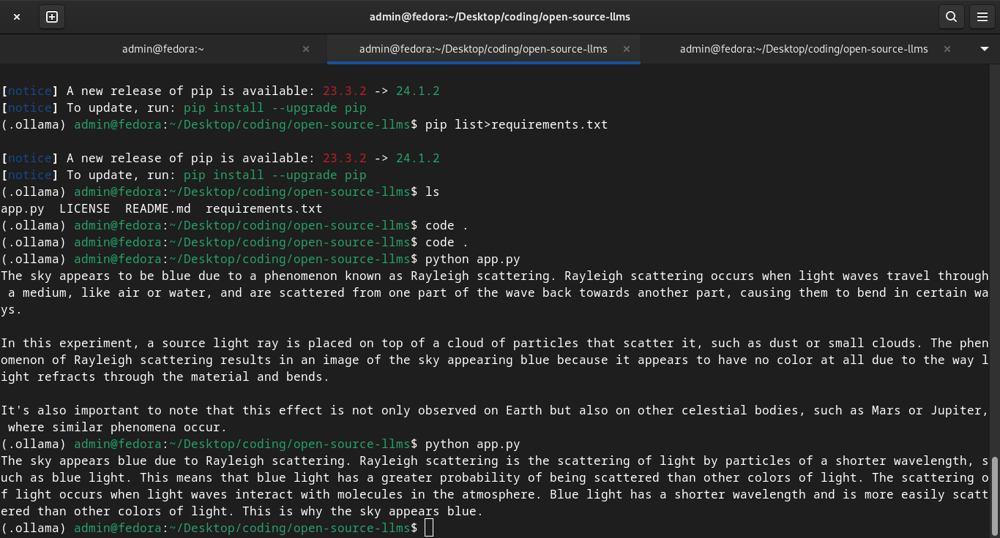

# open-source-llms
 In this repository, I try to utilize and compare open source LLMs from Ollama. Open source LLMs are similar to ChatGPT, but a better definition would be:

 > Open-source large language models (LLMs) are sophisticated neural network-based models designed to understand and generate human language. These models are trained on vast amounts of text data and are capable of performing a wide range of natural language processing tasks such as text generation, translation, summarization, question-answering, and more. The "open-source" aspect means that the model's code and, in some cases, its trained weights are made publicly available for anyone to use, modify, and distribute.

I utilized Ollama, a platform that provides  accessible and efficient tools for working with advanced LLMs. You can find more information ate their site here [Ollama] (https://ollama.com/). You should install its CLI helper based on your OS.

For linux based distros, open the terminal and run:
```bash
    curl -fsSL https://ollama.com/install.sh | sh
```
Once install, command finishes executing confirm if it really does exit on your system:
```bash
    ollama
```

Next you download an LLM of your choosing. There is a list of multiple LLMs on Ollama's [library] (https://ollama.com/library), and you can choose which one best suites your needs. I downloaded 2 popular LLMs, :
- qwen2:0.5b by Alibaba.
```bash
    ollama pull qwen2:0.5b
```
- gemma:2b by Google Gemini project
```bash
    ollama pull gemma:2b
```

They were chose in respect to their resource intensiveness. qwen2:0.5b has around 0.5 billion parameters and only takes up about 352b at the time of documenting this. gemma:2b only has 2 billion parameters and takes up a whooping 1.7GB of space at the time of documenting this.
> Parameters are the weights and biases of the neural network, and they determine how the model processes and generates text

### Running simple prompts in the terminal

To generate simple prompt within the terminal, one uses ollama's run command followed by the model you would like to use to shift into an interactive terminal. 

```bash
    ollama run qwen2:0.5b
```
once in the interactive terminal, you simple input your query and wait fro a response. 

```bash
    >>> what is the general plot of Rick and Morty?
```
attached below are pictures of various reponse from both qwen2:0.5b and gemma:2b, showing a clear contrast of their fine-tuning.





If you are a Rick and Morty fan, then you know that both of these answers are totally wrong, but taking a closer look, we can all agree that the gemma:2b LLM was closer to getting it right. It is however important to note that gemma used up alot more processing power to generate the response as compared to qwen2:0.5b that returned the results almost instantly.

### Running code prompts

To see their effectiveness when operated on programatically, i used a simple python script to compare the results generated:
```bash
    from langchain_ollama import OllamaLLM


    model = OllamaLLM(model='qwen2:0.5b')
    # model = OllamaLLM(model='gemma:2b')

    result = model.invoke(input='Why is the sky blue?')

    print(result)
```

depending on the LLM to used, you can comment and where necessary. The results were quite similar this time though the time taken to generate a reponse by gemma:2b seemed to be thrice as long as that taken by qwen2:0.5b



Due to resource intensiveness, I opted to proceed with the lightweight though not very accurate qwen2:0.5b open source LLM.